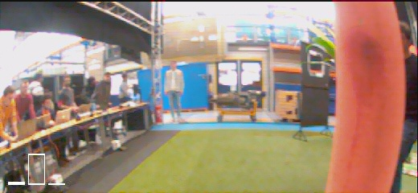

# CNNs for Micro Air Vehicles
This repository contains two notebooks that can be used for the development of CNNs for obstacle avoidance on a drone. The notebooks were developed while participating in the course AE4317 Autonomous Flight of Micro Air Vehicles at Delft University of Technology. The notebooks guide you through the entire process, from data gathering and labeling, to CNN training and actual deployment on a drone. The deployment is done using [Paparazzi UAV](https://github.com/paparazzi/paparazzi) on a Bebop Parrot 2.

### Notebook: `Dataset_generation`
This notebook can be used to generate a labeled dataset. The only prerequisite to use it is to have an image dataset that is representative of the environment in which the drone will fly. It will then label the images based depth maps generated using [Depth-Anything](https://github.com/LiheYoung/Depth-Anything). If you already have a labeled dataset, you can move on to `CNN_trainig.ipynb`. Be aware that this notebook assumes the dataset format that is used in `Dataset_generation.ipynb`.

### Notebook: `CNN_training`
This notebook takes care of the training of CNNs. All the hard work has been done for you, all there is left to do for you is tune the hyperparameters and find the network that best suits your applications. At the end of the notebook it is also explained how to deploy the CNN on a drone using Paparazzi.

### Inference examples
The AE4317 course includes a competition in which student teams try to fly as much distance in a contained area with obstacles. The CNN developed using these notebooks was used in this competition and was succesfully able to avoid obstacles. An example of inference while flying can be seen below, there the bars in the bottom left correspond to 'left', 'forward' and 'right'.

