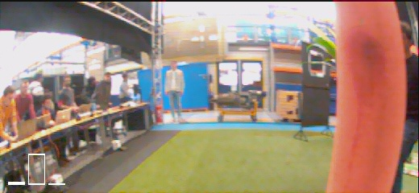

# CNNs for Micro Air Vehicles
Convolutional neural networks have excellent properties when it comes to computer vision tasks such as image processing and classification. Therefore the use of CNNs for obstacle avoidance using only a monocular camera seems like a natural choice. However, CNNs quickly become computationally demanding, a property not desired, especially on Micro Air Vehicles (MAV). As part of the AE4317 Autonomous Flight of Micro Air Vehicles course at Delft University of Technology, I took on the challenge of using CNNs for obstacle avoidance on a Parrot Bebop 2.

Throughout the course I have developed two notebooks which guide you through the entire process: from data gathering and labeling, to CNN training and actual deployment on a drone. The deployment is performed using [Paparazzi UAV](https://github.com/paparazzi/paparazzi). The two notebooks are explained in a bit more detail below.

### Dataset generation:
**Notebook: `Dataset_generation.ipynb`**

This notebook can be used to generate a labeled dataset. The only prerequisite to use this notebook is to have an image dataset that is representative of the environment in which your drone will fly. It will then label the images based on monocular depth maps generated using [Depth-Anything](https://github.com/LiheYoung/Depth-Anything). If you already have a labeled dataset, you can move on to `CNN_training.ipynb`. Be aware that this notebook assumes the dataset format that is used in `Dataset_generation.ipynb`.

### Training and tuning of CNN:
**Notebook: `CNN_training.ipynb`**

This notebook takes care of the training of CNNs. All the hard work has been done, all there is left to do for you is tune the hyperparameters and find the network that best suits your applications. For this it is recommended to use a logging platform such as [Weights and Biases](https://wandb.ai/site) (the one used in the notebook), to keep track of your model performance. At the end of the notebook it is also explained how to deploy the CNN on a drone using Paparazzi UAV.

### Inference example
The AE4317 course includes a competition in which student teams try to fly as much distance in a contained area with obstacles. The CNN developed using these notebooks was used in this competition and was succesfully able to avoid obstacles. An example of inference while flying can be seen below; the bars in the bottom left correspond to 'left', 'forward' and 'right'.

  

